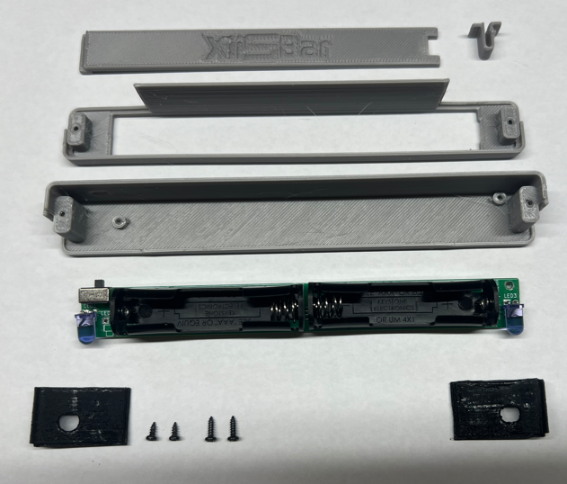

<picture> <source media="(prefers-color-scheme: dark)" srcset="images/XiiSBar_logo.png">  </picture> 

The XiiSBar is a small portable Sensor Bar. The XiiSBar is usefull to fully use the WiiMote on your portable Wii. 

Its small form factor means that you can fix it under a Xii-Boy Pocket stand !

 

## Assembly

This is all the parts you need to build a XiiSBar. 
All the STL for the 3D printed parts are in the STL folder.

The XiiSBar PCB files are available in the PCB folder. All the components are listed in the "BOM.pdf" file 😉

First, put switch slider in the switch hole of the case. Then, rotate the board in place.

⚠ This last part could be a bit tricky to do considering the small tolerances ⚠

After that, you'll need to screew the board in place. Use the M1.7x4 ones.

Place this piece as shown and then fold it. Do the same thing for the other black piece.

Now, take this piece and place it like this. You'll be able to close the case.

Take two M1.7x6 screws and screw the case.

Finally, take the trap and the clip. Put both together. You might need some super glue.

Finally, put the trap on the case and close it !
That's it !
