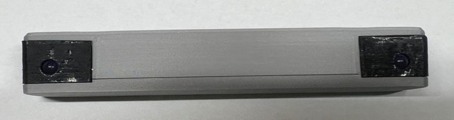

<picture> <source media="(prefers-color-scheme: dark)" srcset="images/XiiSBar_logo.png">  </picture> 

The XiiSBar is a small portable Sensor Bar. It is useful to fully use the WiiMote on your portable Wii. 

Its small form factor means that you can put it under a Xii-Boy Pocket stand !

Check this Bitbuilt Thread for further informations: Not yet, will be here soon 😉

 
## PCB
First, you'll need to order the XiiSBar PCB through [JLCPCB](https://jlcpcb.com/), [PCBWay](https://www.pcbway.com/), [Next PCB](https://www.nextpcb.com/) or  the manufacturer you prefer. 

I personally order mine through [JLCPCB](https://jlcpcb.com/) because it's the cheapest. 

Generally, PCBWay offers a better PCB quality. However, the XiiSBar PCB is very simple, and doesn't require the best quality.
#
Once you've chosen you're manufacturer, upload the [XiiSBar PCB Geber file](https://github.com/Xenii1642/XiiSBar/tree/main/PCB%20Files/Gerber). 

Let the settings by default. Only change the color if you want. Once your order is done, you'll have to order the components for the PCB.

All the components are listed in the [BOM file](https://github.com/Xenii1642/XiiSBar/blob/main/BOM.pdf). I personally ordered them through [Digikey](https://www.digikey.com/en/products).
#
Once you have the PCB and the components, you'll have to assemble it. Each component on the [BOM file](https://github.com/Xenii1642/XiiSBar/blob/main/BOM.pdf) correspond to each label on the PCB.
I used a solder iron set to 360℃ (680℉) with Lead-Free solder. Once the assembly is done, your PCB should look like this:

## Assembly

This is all the parts you need to build a XiiSBar. 
All the STLs for the 3D printed parts are in the STL folder 😉

#
First, put the switch slider in the switch hole of the case. Then, rotate the board in place.

⚠ This last part could be a bit tricky considering the small tolerances ⚠

After that, you'll need to screew the board in place. Use the M1.7x4 ones.

Place this piece as shown below and then fold it. Do the same thing for the other black piece.

⚠ If you deceided to solder the optional LED2, you have to use the "Right + LED" piece instead. ⚠

Now, take this piece and place it like this. You should be able to close the case.

Take two M1.7x6 screws and screw the case.

Finally, take the battery cover and the clip. Put both parts together.⚠ You might need some super glue ⚠

Finally, put the battery cover on the case and close it ! That's it !

If you have any question during the assembly, about the files or other, don't hesistate to ask me 👍
